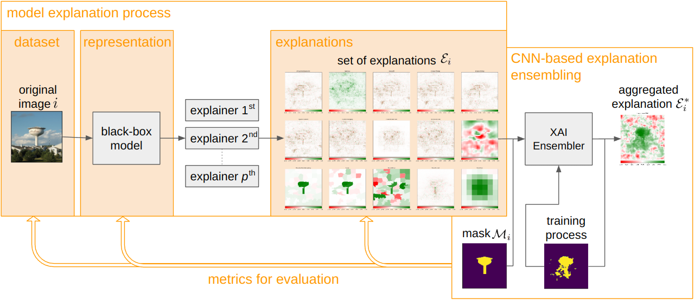

# CNN-based explanation ensembling


[](https://github.com/psf/black)
[](https://arxiv.org/abs/TODO)


<p>
  
  <em>Fig. Overview of CNN-based ensembling of explanations. The diagram illustrates the process that involves an original image being processed by a black-box classification model, followed by an explainer generating explanations. These explanations, along with masks depicting objects in the original image, are then used to train a CNN-based explanation ensembling. The ensembler's training process results in an aggregated image.</em>
</p>


## Installation

The package requirements are as follows:
```
python>=3.8.0
torch>=1.11.0
torchvision>=0.13.0
opencv-python>=4.7.0.72
numpy>=1.21.5
matplotlib>=3.5.
captum>=0.6.0
Pillow>=9.0.1
scikit-image>=0.20.0
scikit-learn>=1.1.1
tqdm>=4.64.0
```

## Getting started

The following example will give you a short introduction to how to get started.


<details>
<summary><b><big>Step 1. Train ensemble of explanations</big></b></summary>

Let's first load the data and train the model. In this example, a model defined in `params.py` is trained. 

```python
# Define column names for the visualization
col_names = ["Original", "Mask", "Predicted mask"] + list(filter(lambda x: x in params.XAI_methods, all_available_methods)) + ["Ensembled XAI"]

# Load the training dataset and create a data loader
train_dataset = ImageNet_Dataset(root_path=params.root_path, phase='train')
train_loader = DataLoader(train_dataset, batch_size=params.batch_size, shuffle=True)
logging.info('Size of the train dataset : {}'.format(len(train_dataset)))

# Load the validation dataset and create a data loader
valid_dataset = ImageNet_Dataset(root_path=params.root_path, phase='valid')
valid_loader = DataLoader(valid_dataset, batch_size=params.batch_size, shuffle=True)
logging.info('Size of the valid dataset : {}'.format(len(valid_dataset)))

# Show an example validation with visualization
show_example(params, valid_dataset, col_names)

# Train the model using the training dataset and validate using the validation dataset
train(params, train_loader, train_dataset, valid_loader, valid_dataset, col_names)

# Visualize the results on the validation dataset
visualize_results(valid_dataset, col_names)
```
</details>

<details>
<summary><b><big>Step 2. Evaluate XAI ensemble on selected images</big></b></summary>
If you already have trained model, you can evaluate it on selected data. There is also defined explainer that can be used as an input to evaluate your explanation using <a href="https://github.com/understandable-machine-intelligence-lab/Quantus/">Quantus</a> library. 

```python
# Load image, label, mask, and explanation
x_batch, y_batch, s_batch, a_batch = retrieve_data(params)

# Load the ensemble model defined in params
model = modelarch.CE_Net_(params).to(params.device)

# Perform an example validation using the Quantus library
attrs = EnsembledXAI_explainer(model=model, inputs=x_batch, targets=y_batch, **{"device": params.device})
```
</details>